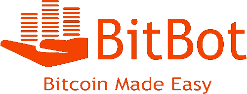

BitBot
======
"Bitcoin made easy"
------------------

Do you find yourself constantly exchanging money for goods and services?

Are you tired of working for that money?

Well we are - and that's why we're introducing BitBot, the app that makes you money!

What is BitBot?
===============

BitBot is a simple online interface for manual and automatic Bitcoin trading.  It incorporates a cryptocurrency value prediction algorithm to assist the user in making informed trading decisions.  Users will be able to seamlessly enter the emerging Bitcoin market, and exploit the power of high-speed computing to improve the performance of their investments.  On top of allowing you to auto-trade, BitBot will also have a simple and easy interface for manual trading of Bitcoin.  Users can see market statistics, choose which exchange to buy from and keep track of their investments all in one place.  Finally, the intent of BitBot is to make Bitcoin trading easy for those that are interested in learning it.  Because of this, we also plan to have step-by-step tutorials showing users how to get started.  This includes getting a Bitcoin wallet, how to use Bitcoins and more.

Who are Team JMASH?
==================

John "The Southern Dandy" O'Rourke
---------------------------------
John is a CS Junior who is interested in Artificial Intelligence.  BitBot is his brainchild and is based off of an AI algorithm he wrote over the summer.  He has taken all of the basic CS courses, as well as CS377, CS383, CS403, and CS585.  Two non-CS classes he has taken and deeply enjoyed are Linguistics 201 (tremendously useful for natural language processing and understanding how words work) and Math 233 (numbers are cool).

Herbert "Hannibal" Perks III
----------------------------
Herbert is a CS Senior whose interested in software engineering. He is currently a Double degree with a B.A in Psychology. he has taken CS187, CS220, CS250, CS311, CS240, CS446, and CS390CG, he is currently taking, CS230,CS320,CS383. Some of the Non CS courses include Psych 380, and psych 330. He cannot wait to get started on BitBot.

Adam Power, M.D.
----------------
Adam is a CS Junior who is interested in Computer Systems and Networking.  He also has a passion for History.  He has taken CS121, CS187, CS220, CS230, CS240, CS250, CS377, and he is currently taking CS311, CS460 and of course, CS326.  His non-CS courses include PoliSci 121 (World Politics) and History 100 (Western Thought up to 1600).  He is excited about Web Programming and he is very excited about getting to work on a big project like BitBot.

Mazen "Dutch" Hamza
-------------------
Mazen is a CS Senior with a subtrack in Software Engineering.  He is currently a project manager for one of the teams in CS 320 and he is also taking CS325 (Usability).  CS courses he has taken in the past are CS187, CS220, CS230, CS240, CS250, CS445 and CS521.

Rev. Sean McGrath
-----------------
Sean is a Junior Physics Major and Computer Science Minor who is passionate about science, software, and alliteration. He has taken CS 121 and 187, and is currently enrolled in CS 230, as well as 326. His Non-CS courses include Classical Mechanics, Quantum Mechanics, and an independent study in Computational Quantum Dynamics. He is excited about BitBot and its potential to make both himself and his classmates a lot of money.

Steve "No nickname" Bourget
---------------------------
Steve is a CS Senior focusing in software development. He has taken CS121, CS 181, CS220, CS230, CS240, CS250, CS311, CS320, CS383, CS445, CS453, and is currently taking CS326, CS305, and CS 521. He spends half of his free time playing ping pong, and the other half thinking about all the money that BitBot will be making him.
